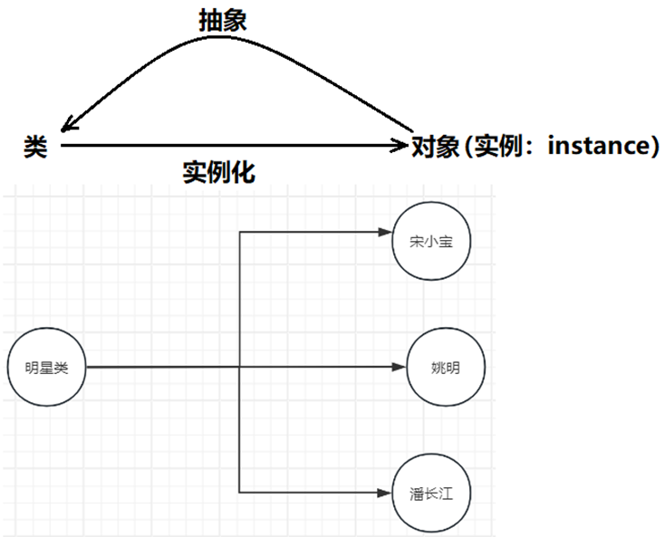
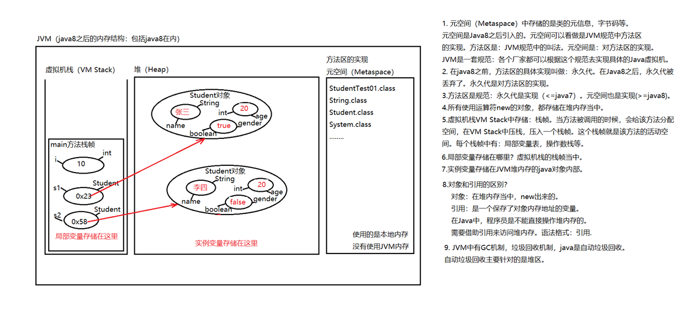
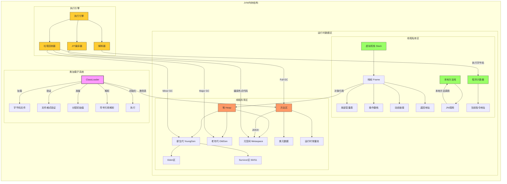

# Java | 面向对象

---


## 面向对象概述

软件开发方法：`面向过程`和`面向对象`

1. **面向过程：`关注点`在`实现功能的步骤上`。**
+ PO：Procedure Oriented。代表语言：C语言

+ 面向过程就是分析出解决问题`所需要的步骤`，然后用函数把这些步骤一步一步实现，使用的时候一个一个依次调用就可以了。

+ 例如开汽车：`启动、踩离合、挂挡、松离合、踩油门、车走了`。

+ 再例如装修房子：`做水电、刷墙、贴地砖、做柜子和家具、入住`。

+ 对于简单的流程是适合使用面向过程的方式进行的。复杂的流程`不适合使用面向过程的开发方式`。

2. **面向对象：`关注点`在`实现功能需要哪些对象的参与`。**
+ `OO`：Object Oriented `面向对象`。包括OOA,OOD,OOP。`OOA`：Object Oriented Analysis `面向对象分析`。`OOD`：Object Oriented Design `面向对象设计`。`OOP`：Object Oriented Programming `面向对象编程`。代表语言：Java、C#、Python等。

+ 人类是以面向对象的方式去认知世界的。所以采用面向对象的思想更加`容易处理复杂的问题`。

+ 面向对象就是分析出解决这个问题都需要哪些对象的参加，然后让对象与对象之间协作起来形成一个系统。

+ 例如开汽车：`汽车对象、司机对象`。司机对象有一个驾驶的行为。`司机对象驾驶汽车对象`。

+ 再例如装修房子：水电工对象，油漆工对象，瓦工对象，木工对象。每个对象都有自己的行为动作。最终完成装修。

+ 面向对象开发方式`耦合度低，扩展能力强`。例如采用面向过程生产一台电脑，不会分CPU、内存和硬盘，它会按照电脑的工作流程一次成型。采用面向对象生产一台电脑，`CPU是一个对象`，`内存条是一个对象`，`硬盘是一个对象`，如果觉得`硬盘容量小`，`后期是很容易更换的`，这就是`扩展性`。


**面向对象三大特征：`封装、继承、多态`**
+ 封装（Encapsulation）
+ 继承（Inheritance）
+ 多态（Polymorphism）


## 类与对象

### 类

+ 现实世界中，`事物与事物之间具有共同特征`，例如：刘德华和梁朝伟都有`姓名、身份证号、身高`等`状态`，都有`吃、跑、跳`等`行为`。将这些共同的`状态和行为`提取出来，`形成了一个模板，称为类`。

+ 类实际上是人类大脑思考`总结的一个模板`，`类`是一个`抽象的概念`。

+ `状态`在程序中对应`属性`。`属性`通常`用变量来表示`。

+ `行为`在程序中对应`方法`。`方法`通常`用函数来表示`。

+ **类 = 属性 + 方法。**


### 对象

+ `实际存在`的`个体`。

+ `对象`又称为`实例（instance）`。

+ 通过类这个模板可以`实例化n个对象`。（`通过类可以创造多个对象`）

+ 例如通过`“明星类”`可以创造出`“刘德华对象”和“梁朝伟对象”`。

+ 明星类中有一个`属性姓名`：`String name;`

+ `“刘德华对象”和“梁朝伟对象”`由于是通过`明星类`造出来的，所以这两个都有`name属性`，但是**值是不同的**。因此这种属性被称为`实例变量`。




# 对象的创建和使用

## 类的定义

**语法格式:**
```java [Java]
[修饰符列表] class 类名 {
    // 属性（描述状态）
    // 方法（描述行为动作）
}
```

> **例如：学生类**

```java [Java]
package com.powernode.javase.oop01;
/*
1.定义类的语法格式:
     [修饰符列表] class 类名{
          类体 = 属性 + 方法

     //属性(实例变量)，描述的是状态

     //方法，描述的是行为动作

     }

2.为什么定义类？
   因为要通过类实例化对象，有了对象，让对象和对象之间协作起来形成系统

3.一个类可以实例化多个java对象，(通过一个类可以造出多个java对象)

4. 实例变量是一个对象一份，比如创建3个学生对象，每个学生对象中应该都有name变量。

5. 实例变量属于成员变量，成员变量如果没有手动赋值，系统会赋默认值
    数据类型        默认值
    ----------------------
    byte            0
    short           0
    int             0
    long            0L
    float           0.0F
    double          0.0
    boolean         false
    char            \u0000
    引用数据类型      null
 */
public class Student {

    //属性：姓名，年龄，性别，它们都是实例变量

    //姓名
    String name;

    //年龄
    int age;

    //性别
    boolean gender;
}
```

## 对象的创建和使用

**语法格式:**
```java [Java]
类名 对象名 = new 类名();
```

**对象的创建：**
```java [Java]
Student s = new Student();
```
> 在Java中，使用`class定义的类`，属于`引用数据类型`。所以`Student`属于`引用数据类型`。类型名为：Student。

> `Student s`; 表示`定义一个变量`。数据类型是`Student`。变量名是`s`。

**对象的使用：**
```java [Java]
读取属性值：s.name
修改属性值：s.name = “jackson”;
```

**通过一个类可以实例化多个对象：**
```java [Java]
Student s1 = new Student();
Student s2 = new Student();
```


> **例如：创建一个学生对象**

```java [Java]
package com.powernode.javase.oop01;

public class StudentTest01 {
    public static void main(String[] args) {
        // 局部变量
        int i = 10;

        // 通过学生类Student实例化学生对象（通过类创造对象）
        // Student s1; 是什么？s1是变量名。Student是一种数据类型名。属于引用数据类型。
        // s1也是局部变量。和i一样。
        // s1变量中保存的是：堆内存中Student对象的内存地址。
        // s1有一个特殊的称呼：引用
        // 什么是引用？引用的本质上是一个变量，这个变量中保存了java对象的内存地址。
        // 引用和对象要区分开。对象在JVM堆当中。引用是保存对象地址的变量。
        Student s1 = new Student();

        // 访问对象的属性（读变量的值）
        // 访问实例变量的语法：引用.变量名
        // 两种访问方式：第一种读取，第二种修改。
        // 读取：引用.变量名 s1.name; s1.age; s1.gender;
        // 修改：引用.变量名 = 值; s1.name = "jack"; s1.age = 20; s1.gender = true;
        System.out.println("姓名：" + s1.name); // null
        System.out.println("年龄：" + s1.age); // 0
        System.out.println("性别：" + (s1.gender ? "男" : "女"));

        // 修改对象的属性（修改变量的值，给变量重新赋值）
        s1.name = "张三";
        s1.age = 20;
        s1.gender = true;

        System.out.println("姓名：" + s1.name); // 张三
        System.out.println("年龄：" + s1.age); // 20
        System.out.println("性别：" + (s1.gender ? "男" : "女")); // 男

        // 再创建一个新对象
        Student s2 = new Student();

        // 访问对象的属性
        System.out.println("姓名=" + s2.name); // null
        System.out.println("年龄=" + s2.age); // 0
        System.out.println("性别=" + (s2.gender ? "男" : "女"));

        // 修改对象的属性
        s2.name = "李四";
        s2.age = 20;
        s2.gender = false;

        System.out.println("姓名=" + s2.name); // 李四
        System.out.println("年龄=" + s2.age); // 20
        System.out.println("性别=" + (s2.gender ? "男" : "女")); // 女
    }
}
```


## JVM内存分析



+ `堆内存`：存储`new出来的对象`。堆内存中的`对象是有生命周期的`。堆内存中的`对象不使用时，由GC回收`。

+ `栈内存`：存储`局部变量`。栈内存中的`局部变量`使用完毕，`立即出栈`，空间被释放。

+ `方法区`：存储`类信息`。方法区中的`类信息`不会被回收。



---

# 封装


## 面向对象三大特征之一：封装

1. 现实世界中封装：

`液晶电视`也是一种`封装好的电视设备`，它`将电视所需的各项零部件封装在一个整体`的`外壳`中，提供给用户一个简单而便利的使用接口，让用户可以轻松地切换频道、调节音量、等。液晶电视内部包含了很多复杂的技术，如显示屏、LED背光模块、电路板、扬声器等等，而这些`内部结构`对于大多数普通用户来说是`不可见的`，用户只需要通过遥控器就可以完成电视的各种设置和操作，这就是封装的好处。液晶电视的封装不仅提高了用户的便利程度和使用效率，而且还起到了保护设备内部部件的作用，防止灰尘、脏物等干扰。同时，液晶电视外壳材料的选择也能起到防火、防潮、防电等效果，为用户的生活带来更安全的保障。

2. 什么是封装？

封装是一种将数据和方法加以包装，使之成为一个独立的实体，并且把它与外部对象隔离开来的机制。具体来说，封装是将一个对象的所有“状态（属性）”以及“行为（方法）”统一封装到一个类中，从而隐藏了对象内部的具体实现细节，向外界提供了有限的访问接口，以实现对对象的保护和隔离。

3. 封装的好处？

封装通过限制外部对对象内部的直接访问和修改，保证了数据的安全性，并提高了代码的可维护性和可复用性。

4. 在代码上如何实现封装？

属性私有化，对外提供getter和setter方法。

## 封装概述

+ `封装`是面向对象三大特性之一。

+ `封装`就是把对象的`属性`和`方法`结合成一个独立的体，对外隐藏内部实现细节。

+ `封装`的好处：`隐藏实现细节`，`提高安全性和易用性`。

+ `封装`的体现：`方法`就是一种封装。`类`也是一种封装。

## 封装的实现方式

+ 将属性私有化（private），提供公共的（public）方法访问私有属性。

+ 例如：学生类

```java [Java]
package com.powernode.javase.oop02;

public class Student {
    // 属性：姓名，年龄，性别，它们都是实例变量
    // 姓名
    private String name;
    // 年龄
    private int age;
    // 性别
    private char gender;// true表示男，false表示女


    public void setName(String name) { // 设置姓名

        this.name = name;
    }

    public String getName() { // 获取姓名
        return name;
    }

    public void setAge(int age) { // 设置年龄
        this.age = age;
    }

    public int getAge() { // 获取年龄
        return age;
    }

    public void setGender(char gender) { // 设置性别
        this.gender = gender;
    }

    public char getGender() { // 获取性别
        return gender;
    }
    public void show() { // 显示信息
        System.out.println("姓名：" + name);
        System.out.println("年龄：" + age);
        System.out.println("性别：" + (gender ? "男" : "女"));
    }
}
```

## 封装的使用

```java [Java]
package com.powernode.javase.oop02;

public class StudentTest02 {
    public static void main(String[] args) {
        // 创建学生对象
        Student s = new Student();

        // 读取属性值
        // System.out.println("姓名：" + s.name); // 编译错误。name是私有的，不能直接访问。
        // System.out.println("年龄：" + s.age); // 编译错误。age是私有的，不能直接访问。
        // System.out.println("性别：" + s.gender); // 编译错误。gender是私有的，不能直接访问。

        // 修改属性值   
        s.setName("张三");
        s.setAge(20);
        s.setGender(true);

        // 读取属性值
        System.out.println("姓名：" + s.getName()); // 张三
        System.out.println("年龄：" + s.getAge()); // 20
        System.out.println("性别：" + (s.getGender() ? "男" : "女")); // 男


        // 调用方法
        s.show();
    }
}
```